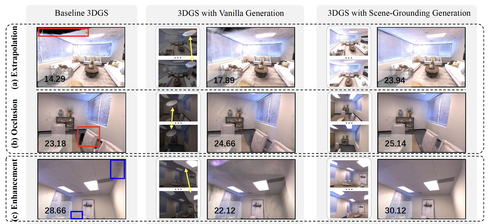

# Taming Video Diffusion Prior with Scene-Grounding Guidance for 3D Gaussian Splatting from Sparse Inputs

 &nbsp;   

This repository contains the code release for the CVPR 2025 project
> [**Taming Video Diffusion Prior with Scene-Grounding Guidance for 3D Gaussian Splatting from Sparse Inputs**](hhttps://arxiv.org/abs/2503.05082),  
> Yingji Zhong, Zhihao Li, Dave Zhenyu Chen, Lanqing Hong, and Dan Xu  
> Computer Vision and Pattern Recognition (CVPR), 2025

 

We tackle the critical issues of (a) extrapolation and (b) occlusion in sparse-input 3DGS by leveraging a video diffusion model. Vanilla generation often suffers from inconsistencies within the generated sequences (as highlighted by the yellow arrows), leading to black shadows in the rendered images. In contrast, our scene-grounding generation produces consistent sequences, effectively addressing these issues and enhancing overall quality (c), as indicated by the blue boxes. The numbers refer to PSNR values.

Code will be released. Please stay tuned. 